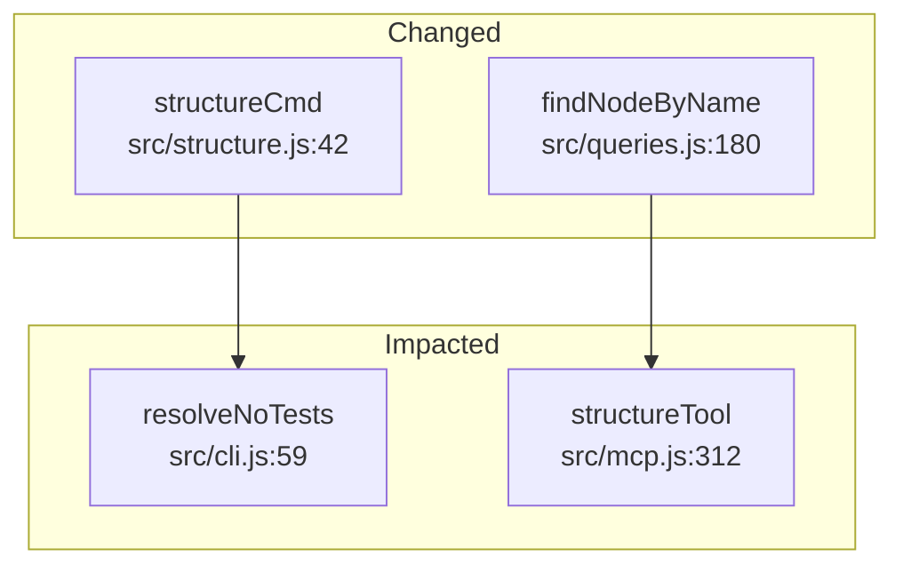
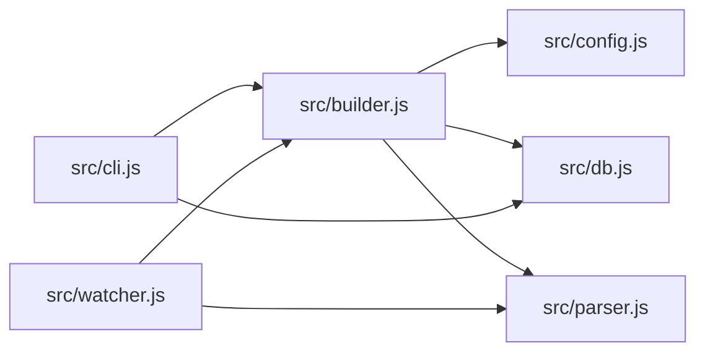
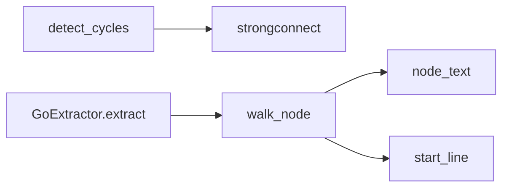

# MCP Server Examples

Codegraph exposes its graph queries as MCP tools so AI coding assistants (Claude, Cursor, Windsurf, etc.) can explore your codebase programmatically.

Start the server:

```bash
codegraph mcp                     # single-repo (default)
codegraph mcp --multi-repo        # access all registered repos
```

Below are example tool calls and the JSON responses your AI assistant will receive. All examples are from codegraph analyzing its own codebase.

---

## where — Quick symbol lookup

**Tool call:**
```json
{
  "tool": "where",
  "arguments": { "target": "buildGraph", "no_tests": true }
}
```

**Response:**
```
f buildGraph  src/builder.js:335  (exported)
  Used in: src/cli.js:77
```

**File mode** — list symbols, imports, and exports for a file:

```json
{
  "tool": "where",
  "arguments": { "target": "src/db.js", "file_mode": true, "no_tests": true }
}
```

```
# src/db.js
  Symbols: openDb:76, initSchema:84, findDbPath:120, openReadonlyOrFail:136
  Imports: src/logger.js
  Imported by: src/builder.js, src/cli.js, src/embedder.js, src/mcp.js, src/queries.js, src/structure.js
  Exported: openDb, initSchema, findDbPath, openReadonlyOrFail
```

---

## explain — Structural summary

```json
{
  "tool": "explain",
  "arguments": { "target": "src/builder.js", "no_tests": true }
}
```

```
# src/builder.js
  949 lines, 10 symbols (4 exported, 6 internal)
  Imports: src/config.js, src/constants.js, src/db.js, src/journal.js, src/logger.js, src/parser.js, src/resolve.js
  Imported by: src/cli.js, src/watcher.js

## Exported
  f collectFiles :45
  f loadPathAliases(rootDir) :101
  f readFileSafe(filePath, retries = 2) :154
  f buildGraph(rootDir, opts = {}) :335

## Internal
  f fileHash(content) :131  -- Compute MD5 hash of file contents for incremental builds.
  f fileStat(filePath) :138  -- Stat a file, returning { mtimeMs, size } or null on error.
  f getChangedFiles(db, allFiles, rootDir) :176
  f getResolved(absFile, importSource) :570
  f isBarrelFile(relPath) :595
  f resolveBarrelExport(barrelPath, symbolName, visited = new Set()) :604

## Data Flow
  getChangedFiles -> fileStat, readFileSafe, fileHash
  buildGraph -> loadPathAliases, collectFiles, getChangedFiles, fileStat, readFileSafe, fileHash
  resolveBarrelExport -> getResolved, isBarrelFile
```

---

## query_function — Callers and callees

```json
{
  "tool": "query_function",
  "arguments": { "name": "buildGraph", "no_tests": true }
}
```

```
Results for "buildGraph":

  f buildGraph (function) -- src/builder.js:335
    -> calls/uses:
      -> openDb (calls) src/db.js:76
      -> initSchema (calls) src/db.js:84
      -> loadConfig (calls) src/config.js:33
      -> getActiveEngine (calls) src/parser.js:316
      -> loadPathAliases (calls) src/builder.js:101
      -> collectFiles (calls) src/builder.js:45
      -> getChangedFiles (calls) src/builder.js:176
      -> writeJournalHeader (calls) src/journal.js:88
      -> normalizePath (calls) src/constants.js:37
      -> parseFilesAuto (calls) src/parser.js:277
      ... and 7 more
    <- called by:
      <- resolveNoTests (calls) src/cli.js:59
```

---

## context — Full function context in one call

The most powerful tool for AI agents — returns source code, dependencies, callers, and signature all at once.

```json
{
  "tool": "context",
  "arguments": { "name": "buildGraph", "no_tests": true }
}
```

```
# buildGraph (function) — src/builder.js:335-948

## Type/Shape Info
  Parameters: (rootDir, opts = {})

## Source
  export async function buildGraph(rootDir, opts = {}) {
    const dbPath = path.join(rootDir, '.codegraph', 'graph.db');
    const db = openDb(dbPath);
    initSchema(db);
    const config = loadConfig(rootDir);
    ...
  }

## Dependencies
  -> openDb (src/db.js:76)
  -> initSchema (src/db.js:84)
  -> loadConfig (src/config.js:33)
  -> collectFiles (src/builder.js:45)
  ...

## Callers
  <- resolveNoTests (src/cli.js:59)
```

Set `depth: 1` to also include source code for direct callees — useful when an agent needs to understand how dependencies work.

---

## file_deps — File-level imports

```json
{
  "tool": "file_deps",
  "arguments": { "file": "src/builder.js", "no_tests": true }
}
```

```
# src/builder.js

  -> Imports (7):
    -> src/config.js
    -> src/constants.js
    -> src/db.js
    -> src/journal.js
    -> src/logger.js
    -> src/parser.js
    -> src/resolve.js

  <- Imported by (1):
    <- src/cli.js

  Definitions (10):
    f collectFiles :45
    f loadPathAliases :101
    f fileHash :131
    f fileStat :138
    f readFileSafe :154
    f getChangedFiles :176
    f buildGraph :335
    f getResolved :570
    f isBarrelFile :595
    f resolveBarrelExport :604
```

---

## fn_deps — Function call chain

```json
{
  "tool": "fn_deps",
  "arguments": { "name": "buildGraph", "no_tests": true }
}
```

```
f buildGraph (function) -- src/builder.js:335

  -> Calls (22):
    -> f openDb  src/db.js:76
    -> f initSchema  src/db.js:84
    -> f loadConfig  src/config.js:33
    -> f getActiveEngine  src/parser.js:316
    -> f loadPathAliases  src/builder.js:101
    -> f collectFiles  src/builder.js:45
    -> f getChangedFiles  src/builder.js:176
    -> f writeJournalHeader  src/journal.js:88
    -> f parseFilesAuto  src/parser.js:277
    -> f resolveImportsBatch  src/resolve.js:150
    ...

  <- Called by (1):
    <- f resolveNoTests  src/cli.js:59
```

---

## fn_impact — Function-level blast radius

```json
{
  "tool": "fn_impact",
  "arguments": { "name": "buildGraph", "no_tests": true }
}
```

```
Function impact: f buildGraph -- src/builder.js:335

  -- Level 1 (1 functions):
      ^ f resolveNoTests  src/cli.js:59

  Total: 1 functions transitively depend on buildGraph
```

---

## symbol_path — Shortest path between two symbols

Find how one function reaches another through the call graph.

```json
{
  "tool": "symbol_path",
  "arguments": { "from": "resolveNoTests", "to": "openDb", "no_tests": true }
}
```

```json
{
  "from": "resolveNoTests",
  "to": "openDb",
  "found": true,
  "hops": 2,
  "path": [
    { "name": "resolveNoTests", "kind": "function", "file": "src/cli.js", "line": 59, "edgeKind": null },
    { "name": "buildGraph", "kind": "function", "file": "src/builder.js", "line": 335, "edgeKind": "calls" },
    { "name": "openDb", "kind": "function", "file": "src/db.js", "line": 76, "edgeKind": "calls" }
  ],
  "alternateCount": 0,
  "edgeKinds": ["calls"],
  "reverse": false,
  "maxDepth": 10
}
```

Reverse direction — follow edges backward:

```json
{
  "tool": "symbol_path",
  "arguments": { "from": "openDb", "to": "buildGraph", "reverse": true, "no_tests": true }
}
```

```json
{
  "from": "openDb",
  "to": "buildGraph",
  "found": true,
  "hops": 1,
  "path": [
    { "name": "openDb", "kind": "function", "file": "src/db.js", "line": 76, "edgeKind": null },
    { "name": "buildGraph", "kind": "function", "file": "src/builder.js", "line": 335, "edgeKind": "calls" }
  ],
  "alternateCount": 0,
  "reverse": true
}
```

When no path exists, `found` is `false` and the path is empty:

```json
{
  "from": "openDb",
  "to": "buildGraph",
  "found": false,
  "hops": null,
  "path": [],
  "alternateCount": 0
}
```

---

## impact_analysis — File-level transitive dependents

```json
{
  "tool": "impact_analysis",
  "arguments": { "file": "src/parser.js", "no_tests": true }
}
```

```
Impact analysis for files matching "src/parser.js":

  # src/parser.js (source)

  -- Level 1 (4 files):
      ^ src/constants.js
      ^ src/watcher.js
      ^ src/builder.js
      ^ src/queries.js

  ---- Level 2 (4 files):
        ^ src/resolve.js
        ^ src/structure.js
        ^ src/cli.js
        ^ src/mcp.js

  Total: 8 files transitively depend on "src/parser.js"
```

---

## diff_impact — Impact of git changes

```json
{
  "tool": "diff_impact",
  "arguments": { "staged": true, "no_tests": true }
}
```

```json
{
  "changedFiles": ["src/structure.js", "src/queries.js"],
  "changedFunctions": [
    { "name": "structureCmd", "file": "src/structure.js", "line": 42 },
    { "name": "findNodeByName", "file": "src/queries.js", "line": 180 }
  ],
  "impacted": [
    { "name": "resolveNoTests", "file": "src/cli.js", "level": 1 },
    { "name": "structureTool", "file": "src/mcp.js", "level": 1 }
  ],
  "totalImpacted": 2
}
```

With `format: "mermaid"`, returns a flowchart for visual rendering:

```json
{
  "tool": "diff_impact",
  "arguments": { "ref": "main", "no_tests": true, "format": "mermaid" }
}
```



---

## module_map — High-level overview

```json
{
  "tool": "module_map",
  "arguments": { "limit": 10, "no_tests": true }
}
```

```
Module map (top 10 most-connected nodes):

  [src/]
    db.js                               <- 19 ->  1  = 20  ####################
    parser.js                           <- 15 -> 13  = 28  ############################
    logger.js                           <- 13 ->  0  = 13  #############
    native.js                           <- 10 ->  0  = 10  ##########
    queries.js                          <- 10 ->  4  = 14  ##############
    builder.js                          <-  7 ->  8  = 15  ###############
    constants.js                        <-  6 ->  1  =  7  #######
    cycles.js                           <-  5 ->  2  =  7  #######
    resolve.js                          <-  5 ->  2  =  7  #######
  [src/extractors/]
    helpers.js                          <-  9 ->  0  =  9  #########

  Total: 101 files, 591 symbols, 933 edges
```

---

## structure — Project directory tree with metrics

```json
{
  "tool": "structure",
  "arguments": { "depth": 2 }
}
```

```
Project structure (15 directories):

crates/  (0 files, 0 symbols, <-0 ->0)
  crates/codegraph-core/  (0 files, 0 symbols, <-0 ->0)
scripts/  (2 files, 8 symbols, <-0 ->0)
  embedding-benchmark.js  146L 3sym <-0 ->0
  update-benchmark-report.js  229L 5sym <-0 ->0
src/  (9 files, 92 symbols, <-6 ->20 cohesion=0.32)
  builder.js  883L 10sym <-2 ->7
  cli.js  570L 1sym <-0 ->10
  db.js  147L 4sym <-7 ->1
  embedder.js  714L 16sym <-2 ->2
  mcp.js  585L 2sym <-1 ->3
  queries.js  2318L 44sym <-3 ->4
  registry.js  163L 7sym <-2 ->1
  structure.js  507L 8sym <-1 ->4
  src/extractors/  (0 files, 0 symbols, <-0 ->0)
```

---

## hotspots — Find structural hotspots

```json
{
  "tool": "hotspots",
  "arguments": { "metric": "fan-in", "level": "file", "limit": 5, "no_tests": true }
}
```

```
Hotspots by fan-in (file-level, top 5):

   1. src/db.js  <-7 ->1  (147L, 4 symbols)
   2. src/queries.js  <-3 ->4  (2318L, 44 symbols)
   3. src/builder.js  <-2 ->7  (883L, 10 symbols)
   4. src/embedder.js  <-2 ->2  (714L, 16 symbols)
   5. src/registry.js  <-2 ->1  (163L, 7 symbols)
```

Available metrics: `fan-in`, `fan-out`, `density`, `coupling`. Levels: `file`, `directory`.

---

## find_cycles — Circular dependency detection

```json
{
  "tool": "find_cycles",
  "arguments": {}
}
```

```
No circular dependencies detected.
```

---

## list_functions — Browse symbols

```json
{
  "tool": "list_functions",
  "arguments": { "file": "src/db.js", "no_tests": true }
}
```

```
f openDb  src/db.js:76  (exported)
f initSchema  src/db.js:84  (exported)
f findDbPath  src/db.js:120  (exported)
f openReadonlyOrFail  src/db.js:136  (exported)
```

Filter by name pattern:

```json
{
  "tool": "list_functions",
  "arguments": { "pattern": "parse", "no_tests": true }
}
```

```
f parseFile  src/parser.js:195  (exported)
f parseFilesAuto  src/parser.js:277  (exported)
f parse_go  crates/codegraph-core/src/extractors/go.rs:1
...
```

---

## semantic_search — Find code by meaning

Requires running `codegraph embed` first to build embeddings.

```json
{
  "tool": "semantic_search",
  "arguments": { "query": "parse source files into AST", "limit": 5 }
}
```

```
Results for "parse source files into AST" (top 5):

  1. f parseFilesAuto  src/parser.js:277     score: 0.82
  2. f parseFile       src/parser.js:195     score: 0.76
  3. f buildGraph      src/builder.js:335    score: 0.68
  4. f collectFiles    src/builder.js:45     score: 0.61
  5. f extractSymbols  src/parser.js:142     score: 0.55
```

---

## export_graph — Graph as DOT, Mermaid, or JSON

```json
{
  "tool": "export_graph",
  "arguments": { "format": "mermaid", "file_level": true }
}
```



Function-level with `file_level: false`:



---

## node_roles — Node role classification

```json
{
  "tool": "node_roles",
  "arguments": { "no_tests": true }
}
```

```
Node roles (639 symbols):

  core: 168  utility: 285  entry: 29  dead: 137  leaf: 20

## core (168)
  f safePath           src/queries.js:14
  f isTestFile         src/queries.js:21
  f getClassHierarchy  src/queries.js:76
  ...

## entry (29)
  f command:build      src/cli.js:89
  f command:query      src/cli.js:102
  ...
```

Filter by role:

```json
{
  "tool": "node_roles",
  "arguments": { "role": "dead", "no_tests": true }
}
```

```
Node roles (137 symbols):

  dead: 137

## dead (137)
  f main                 crates/codegraph-core/build.rs:3
  - TarjanState          crates/codegraph-core/src/cycles.rs:38
  - CSharpExtractor      crates/codegraph-core/src/extractors/csharp.rs:6
  ...
```

Filter by role and file:

```json
{
  "tool": "node_roles",
  "arguments": { "role": "core", "file": "src/queries.js" }
}
```

```
Node roles (16 symbols):

  core: 16

## core (16)
  f safePath             src/queries.js:14
  f isTestFile           src/queries.js:21
  f getClassHierarchy    src/queries.js:76
  f resolveMethodViaHierarchy  src/queries.js:97
  f findMatchingNodes    src/queries.js:127
  ...
```

---

## co_changes — Git co-change analysis

Query top co-changing file pairs:

```json
{
  "tool": "co_changes",
  "arguments": { "no_tests": true }
}
```

```
Top co-change pairs:

  100%     3 commits  src/extractors/csharp.js  <->  src/extractors/go.js
  100%     3 commits  src/extractors/csharp.js  <->  src/extractors/java.js
  100%     3 commits  src/extractors/go.js      <->  src/extractors/java.js
  ...

  Analyzed: 2026-02-26 | Window: 1 year ago
```

Query co-change partners for a specific file:

```json
{
  "tool": "co_changes",
  "arguments": { "file": "src/queries.js" }
}
```

```
Co-change partners for src/queries.js:

   43%    12 commits  src/mcp.js

  Analyzed: 2026-02-26 | Window: 1 year ago
```

---

## symbol_path — Shortest path between two symbols

```json
{
  "tool": "symbol_path",
  "arguments": { "from": "buildGraph", "to": "resolveImports", "no_tests": true }
}
```

```
Path: buildGraph → resolveImports (1 hop)

  buildGraph  src/builder.js:335  →(calls)→  resolveImports  src/resolve.js:42

  Hops: 1 | Alternate paths: 0
```

```json
{
  "tool": "symbol_path",
  "arguments": { "from": "buildGraph", "to": "isTestFile", "no_tests": true }
}
```

```
Path: buildGraph → isTestFile (2 hops)

  buildGraph      src/builder.js:335
    →(calls)→  collectFiles  src/builder.js:45
    →(calls)→  isTestFile    src/queries.js:21

  Hops: 2 | Alternate paths: 1
```

---

## complexity — Per-function complexity metrics

```json
{
  "tool": "complexity",
  "arguments": { "no_tests": true, "limit": 5 }
}
```

```
# Function Complexity

  Function                                 File                            Cog  Cyc  Nest    MI
  ──────────────────────────────────────── ────────────────────────────── ──── ──── ───── ─────
  buildGraph                               src/builder.js                  495  185     9     - !
  extractJavaSymbols                       src/extractors/java.js          208   64    10  13.9 !
  extractSymbolsWalk                       src/extractors/javascript.js    197   72    11  11.1 !
  walkJavaNode                             src/extractors/java.js          161   59     9    16 !
  walkJavaScriptNode                       src/extractors/javascript.js    160   72    10  11.6 !

  339 functions analyzed | avg cognitive: 18.8 | avg cyclomatic: 10.5 | avg MI: 22 | 106 above threshold
```

With health view (Halstead metrics):

```json
{
  "tool": "complexity",
  "arguments": { "no_tests": true, "health": true, "limit": 5 }
}
```

```
# Function Complexity

  Function                            File                         MI     Vol   Diff    Effort   Bugs   LOC  SLOC
  ─────────────────────────────────── ───────────────────────── ───── ─────── ────── ───────── ────── ───── ─────
  buildGraph                          src/builder.js                0       0      0         0      0     0     0
  extractJavaSymbols                  src/extractors/java.js     13.9!6673.96  70.52 470637.77 2.2247   225   212
  extractSymbolsWalk                  …tractors/javascript.js    11.1!7911.66  50.02 395780.68 2.6372   251   239
  walkJavaNode                        src/extractors/java.js       16!5939.15  65.25 387509.16 1.9797   198   188
  walkJavaScriptNode                  …tractors/javascript.js    11.6!7624.39  47.67 363429.06 2.5415   240   230

  339 functions analyzed | avg cognitive: 18.8 | avg cyclomatic: 10.5 | avg MI: 22 | 106 above threshold
```

Scope to a specific file:

```json
{
  "tool": "complexity",
  "arguments": { "file": "src/builder.js", "no_tests": true }
}
```

---

## communities — Community detection & drift analysis

```json
{
  "tool": "communities",
  "arguments": { "no_tests": true }
}
```

```
# File-Level Communities

  41 communities | 73 nodes | modularity: 0.4114 | drift: 39%

  Community 34 (16 members): src (16)
    - src/cochange.js
    - src/communities.js
    - src/cycles.js
    - src/embedder.js
    - src/logger.js
    - src/registry.js
    - src/structure.js
    - src/update-check.js
    ... and 8 more
  Community 35 (12 members): src/extractors (11), src (1)
    - src/extractors/csharp.js
    - src/extractors/go.js
    - src/extractors/helpers.js
    - src/extractors/javascript.js
    ... and 8 more
  Community 33 (6 members): src (6)
    - src/builder.js
    - src/constants.js
    - src/journal.js
    - src/native.js
    - src/resolve.js
    - src/watcher.js
```

Drift analysis only:

```json
{
  "tool": "communities",
  "arguments": { "drift": true, "no_tests": true }
}
```

```
# Drift Analysis (score: 39%)

  Split candidates (directories spanning multiple communities):
    - scripts → 13 communities
    - crates/codegraph-core/src/extractors → 11 communities
    - src → 4 communities
  Merge candidates (communities spanning multiple directories):
    - Community 35 (12 members) → 2 dirs: src/extractors, src
```

Function-level community detection:

```json
{
  "tool": "communities",
  "arguments": { "functions": true, "no_tests": true }
}
```

---

## manifesto — Rule engine pass/fail

```json
{
  "tool": "manifesto",
  "arguments": { "no_tests": true }
}
```

```
# Manifesto Results

  Rule                      Status   Threshold         Violations
  ────────────────────────── ──────── ──────────────── ──────────
  cognitive_complexity       FAIL     warn>15 fail>30   84 functions
  cyclomatic_complexity      FAIL     warn>10 fail>20   42 functions
  nesting_depth              FAIL     warn>4 fail>6     28 functions
  maintainability_index      FAIL     warn<40 fail<20   52 functions
  halstead_bugs              WARN     warn>0.5 fail>1   18 functions

  Result: FAIL (exit code 1)
```

---

## audit — Composite risk report

Combines explain + impact + complexity metrics in one call — gives an agent everything it needs to assess a function.

```json
{
  "tool": "audit",
  "arguments": { "target": "buildGraph", "no_tests": true }
}
```

```
# Audit: buildGraph (function) — src/builder.js:335
  Parameters: (rootDir, opts = {})
  Complexity: cognitive=495 cyclomatic=185 nesting=9 MI=0 ⚠
  Impact: 1 transitive callers
    ^ resolveNoTests  src/cli.js:59
  Calls: openDb, initSchema, loadConfig, collectFiles, getChangedFiles, ...
```

Audit an entire file:

```json
{
  "tool": "audit",
  "arguments": { "target": "src/builder.js", "no_tests": true }
}
```

---

## batch_query — Multi-target batch querying

Accept a list of targets and return all results in one JSON payload — enables multi-agent parallel dispatch.

```json
{
  "tool": "batch_query",
  "arguments": { "targets": ["buildGraph", "openDb", "parseFile"], "no_tests": true }
}
```

```json
{
  "results": [
    { "target": "buildGraph", "context": { "..." }, "impact": { "..." } },
    { "target": "openDb", "context": { "..." }, "impact": { "..." } },
    { "target": "parseFile", "context": { "..." }, "impact": { "..." } }
  ],
  "total": 3,
  "errors": []
}
```

---

## triage — Risk-ranked audit queue

Merges connectivity, hotspots, node roles, and complexity into a prioritized queue.

```json
{
  "tool": "triage",
  "arguments": { "no_tests": true, "limit": 5 }
}
```

```
# Triage Queue (top 5)

  Rank  Function                   File                      Role     Cog  Cyc   MI  Score
  ───── ────────────────────────── ───────────────────────── ──────── ──── ──── ──── ──────
     1  buildGraph                 src/builder.js            core      495  185    0   98.5
     2  extractJavaSymbols         src/extractors/java.js    utility   208   64   14   87.2
     3  extractSymbolsWalk         src/extractors/js.js      utility   197   72   11   85.1
     4  walkJavaNode               src/extractors/java.js    utility   161   59   16   79.3
     5  startMCPServer             src/mcp.js                core       45   20   32   72.8
```

---

## check — CI validation predicates

Configurable pass/fail gates. Returns structured results with exit status.

```json
{
  "tool": "check",
  "arguments": { "staged": true, "no_new_cycles": true, "max_complexity": 30 }
}
```

```json
{
  "checks": [
    { "name": "no-new-cycles", "passed": true, "detail": "no new cycles introduced" },
    { "name": "max-complexity", "passed": false, "threshold": 30, "violations": [
      { "name": "buildGraph", "file": "src/builder.js", "line": 335, "cognitive": 495 },
      { "name": "extractJavaSymbols", "file": "src/extractors/java.js", "cognitive": 208 }
    ]}
  ],
  "passed": false
}
```

```json
{
  "tool": "check",
  "arguments": { "staged": true, "max_blast_radius": 50, "no_boundary_violations": true }
}
```

```json
{
  "checks": [
    { "name": "max-blast-radius", "passed": true, "detail": "max blast radius is 1" },
    { "name": "no-boundary-violations", "passed": true, "detail": "no violations" }
  ],
  "passed": true
}
```

---

## code_owners — CODEOWNERS integration

```json
{
  "tool": "code_owners",
  "arguments": { "target": "src/queries.js", "no_tests": true }
}
```

```
# Ownership: src/queries.js

  Owner: @backend-team
  Functions: 44

  f safePath           src/queries.js:14     @backend-team
  f isTestFile         src/queries.js:21     @backend-team
  f findMatchingNodes  src/queries.js:127    @backend-team
  ...
```

Ownership boundaries:

```json
{
  "tool": "code_owners",
  "arguments": { "boundary": true, "no_tests": true }
}
```

---

## branch_compare — Structural diff between refs

```json
{
  "tool": "branch_compare",
  "arguments": { "base": "main", "target": "HEAD", "no_tests": true }
}
```

```json
{
  "added": [
    { "name": "checkBoundaries", "kind": "function", "file": "src/boundaries.js", "line": 45 }
  ],
  "changed": [
    { "name": "manifestoData", "kind": "function", "file": "src/manifesto.js", "line": 88, "changeType": "signature" }
  ],
  "removed": [],
  "impact": {
    "totalCallers": 4,
    "callers": [
      { "name": "resolveNoTests", "file": "src/cli.js", "line": 59 }
    ]
  }
}
```

With Mermaid output:

```json
{
  "tool": "branch_compare",
  "arguments": { "base": "main", "target": "HEAD", "format": "mermaid", "no_tests": true }
}
```

---

## list_repos — Multi-repo registry (multi-repo mode only)

Only available when the MCP server is started with `--multi-repo`.

```json
{
  "tool": "list_repos",
  "arguments": {}
}
```

```
Registered repositories:

  my-app
    Path: /home/user/projects/my-app
    DB:   /home/user/projects/my-app/.codegraph/graph.db

  shared-lib
    Path: /home/user/projects/shared-lib
    DB:   /home/user/projects/shared-lib/.codegraph/graph.db
```

In multi-repo mode, every tool accepts an optional `repo` parameter to target a specific repository:

```json
{
  "tool": "where",
  "arguments": { "target": "handleRequest", "repo": "my-app", "no_tests": true }
}
```
